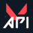

## Junior Full Stack Developer | Music Enthusiast | Tech Innovator | Game Enjoyer


---

<p align="center">
  <a href="mailto:vicenteppfigueiredo@gmail.com" target="_blank"></a>
  <a href="https://www.linkedin.com/in/vicentefigueiredo" target="_blank"></a>
  <a href="https://www.youtube.com/@sawsent" target="_blank"></a>
  <a href="https://www.twitch.tv/sawsent" target="_blank"></a>
  <a href="https://medium.com/@vicenteppfigueiredo" target="_blank"></a>
  <a href="https://dev.to/sawsent" target="_blank"></a>
  <a href="https://www.google.com/maps/place/Porto/@41.1622468,-8.6631531,13z/data=!3m1!4b1!4m6!3m5!1s0xd2465abc4e153c1:0xa648d95640b114bc!8m2!3d41.1579438!4d-8.6291053!16zL20vMHBtbjc?entry=ttu" target="_blank"></a>
</p>

---

## About Me
I'm a learning junkie that thrives in challenging environments. I love to adapt and take on new challenges. With a background in sales and my own business in animated explainers, I blend creativity with technology. A classically trained violinist and a lover of mathematics and physics, I seek to innovate and inspire. I also love gaming and was a semi-pro Valorant player.

## Skills

### Languages 
[](#)
### Frameworks and tools
[](#)  
### IDEs I like
[](https://www.github.com/sawsent/nvim)
[](https://www.jetbrains.com/idea/)
[](https://www.jetbrains.com/clion/)
[](https://code.visualstudio.com/)


## Current Projects

### Fullstack Expense Management App
#### Stack:

[](#)  <br>
[](#)

#### Goals:
Deepen React Skills, Leverage Java Expertise, Explore AI Opportunities, Full-Stack Integration, Master Security Practices

#### Links:
<p>
  <a href="https://www.github.com/sawsent/expensemanagement" target="_blank"> </a>
</p>

#### Notes:
This is a really ambitious project that I'll work on as I expand my knowledge and put my skills to the test.

---

### Valorant Tracker Single Page Application
#### Stack:
<p>
  
  
</p>

#### Goals:
Enhance Real-Time Data Handling, Improve API Integration Skills, Refine HTML and CSS Mastery

#### Links:
<p>
  <a href="https://www.github.com/sawsent/valoranttracker" target="_blank"> </a>
  <a href="https://valorant-api.com/" target="_blank"> </a>
  <a href="https://app.swaggerhub.com/apis/Henrik-3/HenrikDev-API/3.0.0" target="_blank"> </a>
</p>

## Current Goals

### Consistent Content Creation
**Aim:** Stream consistently on Twitch and regularly post engaging videos on YouTube to build a dedicated audience and enhance my digital presence. Also, please check it out and give me a follow, I greatly appreciate it!
<p>
  <a href="https://www.youtube.com/@sawsent" target="_blank"></a>
  <a href="https://www.twitch.tv/sawsent" target="_blank"></a>
</p>

### Regular Writing
**Aim:** Commit to writing and publishing at least one article every month on platforms like Dev.to or Medium, focusing on topics related to my tech journey and learning experiences.
<p>
  <a href="https://medium.com/@vicenteppfigueiredo" target="_blank"></a>
  <a href="https://dev.to/sawsent" target="_blank"></a>
</p>

### Expand Web Development Knowledge
**Aim:** Deepen my understanding of web development by exploring new technologies, frameworks, and best practices to enhance my skill set.

### Learn Low-Level Programming
**Aim:** Acquire fundamental knowledge in low-level programming by studying C++, which will provide a solid base for understanding system architecture and performance optimization.

### Learn Mathematics for AI and ML
**Aim:** Engage in rigorous study of the mathematical concepts and theories underlying machine learning and artificial intelligence to prepare for advanced applications and innovations.

### Land My First Tech Job
**Aim:** Secure my first position in the technology industry, leveraging my skills and experiences to start a successful career in tech.

## Background
```yaml
{
  "experience": [
    {
      "role": "Founder & CEO",
      "company": "Simplify Clarity",
      "start": "jan23",
      "end": "jan24",
      "responsibilities": [
        "Led startup operations.",
        "Created tech explainer videos.",
        "Leveraged tools and outsourcing to increase productivity"
      ],
      "learned": [
        "Entrepreneurial leadership skills.",
        "Business strategy development.",
        "Marketing and product management."
      ]
    },
    {
      "role": "Sales Representative",
      "company": "ManPower - Endesa",
      "start": "may23",
      "end": "dec23",
      "responsibilities": [
        "First contact for potential customers.",
        "Surpassed sales targets by 125%.",
        "Adapted sales strategies effectively."
      ],
      "learned": [
        "Enhanced customer engagement techniques.",
        "Sales strategy flexibility.",
        "Mentorship leverage for skill enhancement."
      ]
    },
    {
      "role": "Professional Valorant Player",
      "company": "multiple orgs (FVR, HUSH, HUA)",
      "start": "feb22",
      "end": "dec22",
      "responsibilities": [
        "Competed in top-tier tournaments.",
        "Team strategy development.",
        "Data-driven performance analysis.",
        "Extracted and analyzed game data using Python to identify Points of Failure and Pitfalls."
      ],
      "learned": [
        "Teamwork and communication under pressure.",
        "Strategic competitive play.",
        "Complex problem solving and discipline.",
        "Navigating complex personal and team discussions and issues outside the server."
      ]
    }
  ],
  "education": [
    {
      "type": "bootcamp",
      "name": "Full Stack Programming Bootcamp",
      "institution": "Code for All_",
      "start": "jan24",
      "end": "apr24"
    },
    {
      "type": "degree",
      "name": "German International Abitur",
      "institution": "Porto German School",
      "start": "sep19",
      "end": "jul21"
    },
    {
      "type": "specialization",
      "name": "Specialized Art Education in Music",
      "institution": "Porto Conservatory of Music",
      "start": "sep18",
      "end": "jul22"
    }
  ]
}
```

## My GitHub Stats
<!-- Git status cards -->
<p align="center">
    
</p>

<div align="center">
    
    
</div>

