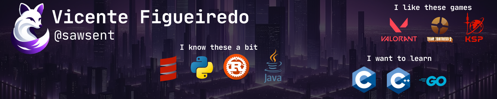

# Vicente 'sawsent' Figueiredo
### Software Engineer • Builder • Musician • Gamer • Neovim enjoyer



<p align="center">
  <a href="mailto:vicenteppfigueiredo@gmail.com"></a>
  <a href="https://www.linkedin.com/in/vicentefigueiredo"></a>
  <a href="https://www.youtube.com/@sawsent"></a>
  <a href="https://www.twitch.tv/sawsent"></a>
  <a href="https://medium.com/@vicenteppfigueiredo"></a>
  <a href="https://dev.to/sawsent"></a>
</p>

---

## About Me

I'm a software engineer who loves **building useful things and learning fast**.

I come from a mix of tech, business, and creativity:

- Associate Software Engineer @ Blip  
- Founder of an animated explainers startup  
- Classically trained violinist  
- Former semi-pro Valorant player  

Math, music, gaming, and code all scratch the same itch for me — solving problems and creating cool stuff.

Check out my streams & videos if you like dev + gaming content 👀

---

## Stack
[](#)

---

## Featured Project

### [Nelson — AI in your terminal](https://github.com/sawsent/nelson)

A Unix CLI tool written in rust that brings AI directly into your workflow.


---

## Experience

```json
{
  "current": {
    "role": "Associate Software Engineer",
    "company": "Blip.pt",
    "since": "2025"
  },
  "previous": [
    "Software Engineering Intern @ Blip.pt (BETa 2024–2025)",
    "Founder & CEO @ Simplify Clarity",
    "Sales Representative @ Endesa",
    "Semi-Pro Valorant Player (FVR, HUSH, HUA)"
  ]
}
```

---

## Outside of Coding

You’ll probably find me:
- jamming to some Bach  
- grinding ranked  
- building side projects at 2am
- playing Padel

If that sounds like your vibe, let’s connect 🤝
