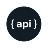

## Junior Full Stack Developer | Music Enthusiast | Tech Innovator | Game Enjoyer


---

<p align="center">
  <a href="mailto:vicenteppfigueiredo@gmail.com"></a>
  <a href="https://www.linkedin.com/in/vicentefigueiredo"></a>
  <a href="https://www.youtube.com/@sawsent"></a>
  <a href="https://www.twitch.tv/sawsent"></a>
  <a href="https://medium.com/@vicenteppfigueiredo"></a>
  <a href="https://dev.to/sawsent"></a>
  <a href="https://www.google.com/maps/place/Porto/@41.1622468,-8.6631531,13z/data=!3m1!4b1!4m6!3m5!1s0xd2465abc4e153c1:0xa648d95640b114bc!8m2!3d41.1579438!4d-8.6291053!16zL20vMHBtbjc?entry=ttu"></a>
</p>

---

## About Me

I’m a learning junkie that thrives in challenging environments. I love to adapt and take on new challenges. With a background in sales and my own business in animated explainers, I blend creativity with technology. A classically trained violinist and a lover of mathematics and physics, I seek to innovate and inspire.

## Skills

### Languages 
[](https://www.twitch.tv/sawsent)
### Frameworks
[](https://www.twitch.tv/sawsent)
### Other Tools 
Tomcat, RESTful services, Agile methodologies,

## Current Projects

### Valorant Tracker Single Page Application
#### Stack:
<p>
   
  
</p>

#### Description: 
A web application designed to help Valorant players track their game stats, analyze performance trends, and compare with other players. Also has the feature to see scheduled esports events, games and their score. <br>
Also planning on adding a way to visualize current competitive maps and agents using the official RIOT games valorant API.

#### Goals:
Through this project, I aim to deepen my understanding of real-time data handling and enhance my skills in creating responsive single-page applications using JavaScript. <br>
Moreover, I want to get better at working with external APIs and become more efficient at figuring them out through the documentation. <br>
I also want to deepen my understanding and intuition for HTML and CSS.

#### Links:
<p>
  <a href="https://www.github.com/sawsent/valoranttracker"> </a>
</p>

---

### Personal Expense Management Fullstack App
**Description:** This app helps users manage their personal finances by tracking expenses, categorizing them, and providing insightful spending analytics. <br> <br>
**Goals:** I am focusing on integrating secure authentication and learning more about state management in full-stack environments. I hope to master complex SQL queries and improve my backend development skills with Spring Boot.

## Current Goals


## Background
```yaml
{
  "experience": [
    {
      "role": "Founder & CEO",
      "company": "Simplify Clarity",
      "start": "jan23",
      "end": "jan24",
      "responsibilities": "Led a startup creating animated explainers for tech startups globally."
    },
    {
      "role": "Sales Representative",
      "company": "ManPower - Endesa",
      "start": "may23",
      "end": "dec23",
      "responsibilities": "Attracting and generating interest in potential customers, while being the first point of contact. \
                          Achieved 125% of the sales objective by adapting to customers, \
                          testing different strategies and approaches, \
                          and seeking our Team Leader's mentorship."
    }
  ],
  "education": [
    {
      "type": "bootcamp",
      "name": "Full Stack Programming Bootcamp",
      "institution": "Code for All_",
      "start": "jan24",
      "end": "apr24"
    },
    {
      "type": "degree",
      "name": "German International Abitur",
      "institution": "Porto German School",
      "start": "sep19",
      "end": "jul21"
    },
    {
      "type": "specialization",
      "name": "Specialized Art Education in Music",
      "institution": "Porto Conservatory of Music",
      "start": "sep18",
      "end": "jul22"
    }
  ]
}
```
## My GitHub Stats


